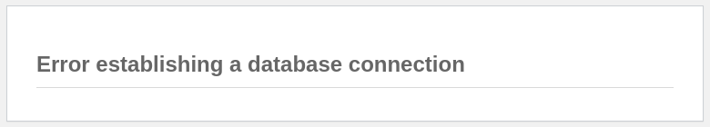
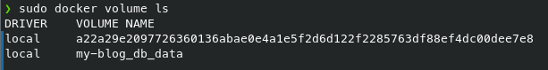
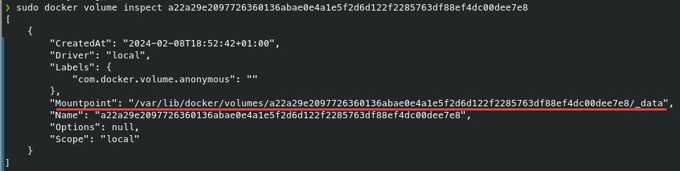
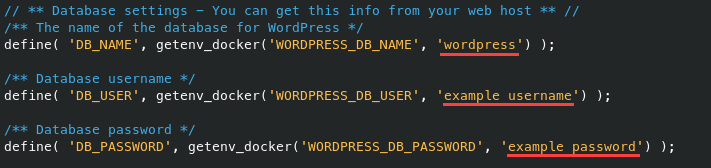
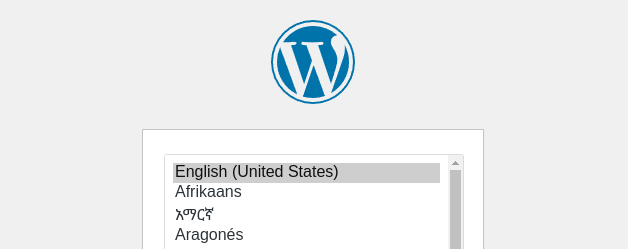

# WordPress Docker Template
[](https://github.com/Sygnator/wordpress-docker-template)
[](https://opensource.org/licenses/MIT)
[](https://wordpress.org/)
[](https://www.docker.com/)

This repository contains a setup for running **WordPress** locally using Docker Compose. Follow the steps below to set up and run WordPress using Docker.

## Usage

1. **Clone the repository**:
    ```bash
    git clone git@github.com:Sygnator/wordpress-docker-template.git
    ```
2. **Navigate to the project directory**:
    ```bash
    cd wordpress-docker-template
    ```
3. **Copy the `.env-example` file**:
    ```bash
    cp .env-example .env
    ```
   Modify the environment variables to suit your requirements.

4. **Start Docker Compose**:
    ```bash
    docker compose up -d
    ```
5. **Access WordPress**:

    Once Docker Compose has finished setting up the environment, you can access WordPress by navigating to http://localhost:8000 in your web browser.

## Troubleshooting

### **Port conflicts**:
Ensure that port _8000_ is not used by any other application on your system. If it is, you can modify the port in the `docker-compose.yml` file to use a different port.


### **Database connection errors**:


If you encounter the _error establishing a database connection_ message, follow these steps to troubleshoot and resolve the issue (Linux).

1. Locate your volume where `wp-config.php` file is stored:
    ```bash
    sudo docker volume ls
    ```
    

2. Check the directory (mountpoint) of your volume:
    ```bash
    sudo docker volume inspect {your_volume}
    ```
    

3. Edit the `wp-config.php` file in this directory:
    ```bash
    sudo nano /var/lib/docker/volumes/{your_volume}/_data/wp-config.php
    ```
    

    Verify if `DB_NAME`, `DB_USER`, `DB_PASSWORD` match those set in the `.env` file, and replace them with the correct values if necessary.

4. After refreshing the page, the site should work.
    
